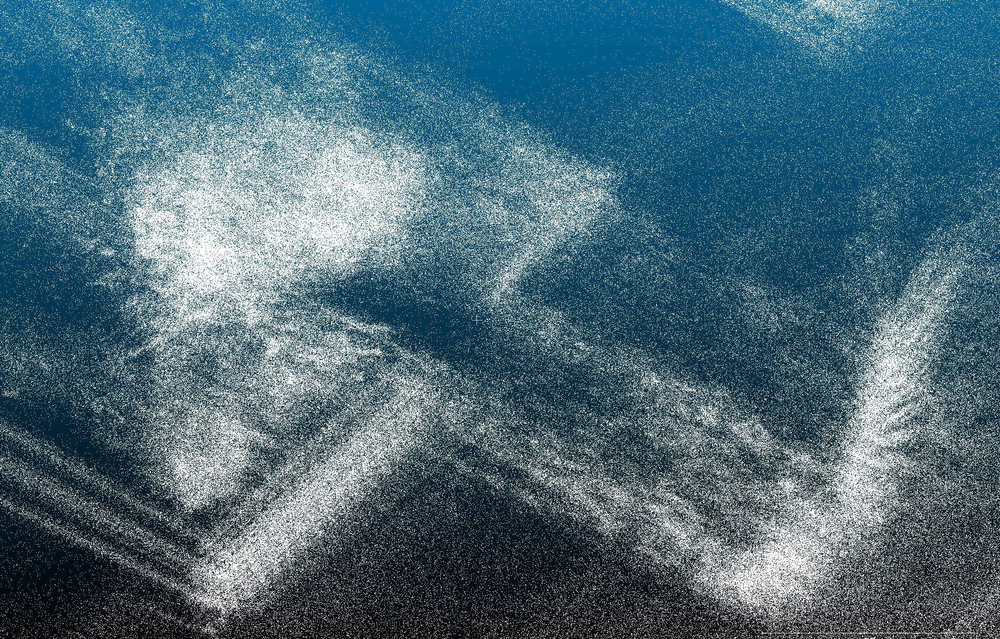
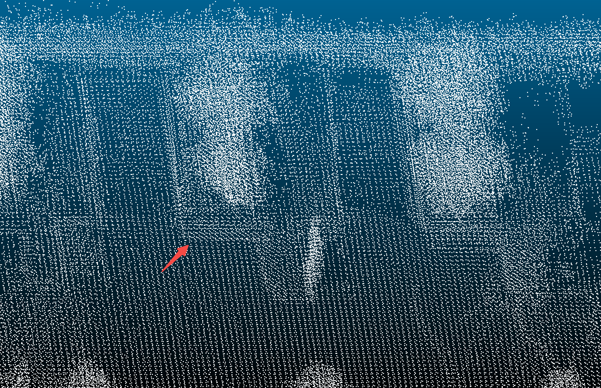
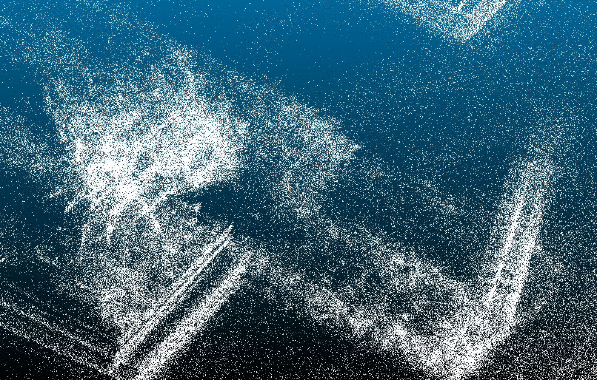
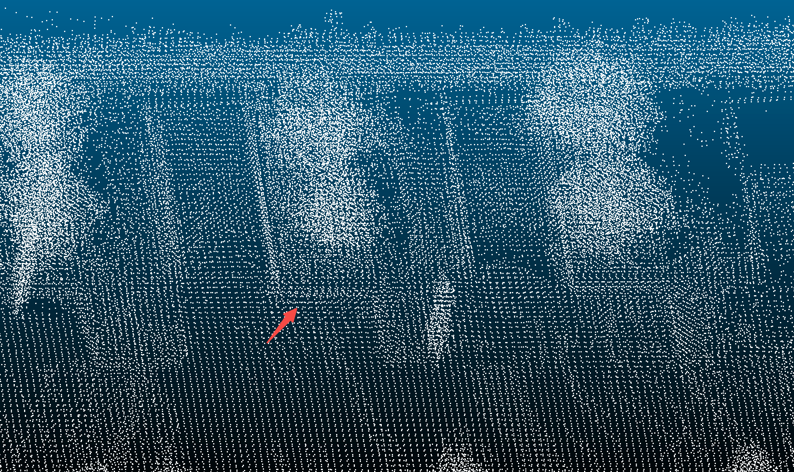

## lidar-imu-calibration
**LI-Init** is a robust, real-time initialization method for LiDAR-inertial system. We made some modifications to the code to enable the program to support lidars without ring outputs (which are common in Apollo systems).

### Processing databag
#### Record Apollo record
First, In Apollo container, running lidar and gnss drivers. (This following code is from my environment. You may need to start different DAGs in your environment, but regardless, ensure that GNSS and LIDAR outputs are functioning normally)
```
mainboard -d modules/drivers/gnss/dag/gnss.dag
mainboard -d modules/drivers/lidar/vanjeelidar/dag/vanjeelidar.dag
```

After that, running cyber_recorder to record all data from gnss and lidar.
```
mkdir -p record/apollo && cyber_recorder record -a -o record/apollo/cal
```

Then, maneuver the vehicle to provide ample movement stimulation. Such as:
* Remain stationary for ≥5–10 seconds (Do not move after starting to accumulate the initial map).
* Up/downhill 2 times each (garage ramp/entrance/exit/road shoulder slope), generating pitch.
* Drive over speed bumps/low road humps twice on each side (left and right), or drive diagonally over them to induce roll.
* Low-speed S-shaped steering/roundabout maneuvering for 2–3 laps to generate yaw (ideally with varying yaw rates—alternating between fast and slow with accelerating changes).
* Steps 2, 3, and 4 may be repeated as needed. The entire data recording process takes approximately 500 seconds.

In the end stop cyber_recorder, and move the `record` folder to Li-Init root folder.

#### Convert record to rosbag
First, using pip install bag_convert
```
pip3 install bag_convert
```
To ensure the data meets the input requirements of Li-Init, some modifications are necessary.
⚠️ **The following path is on my environment, you should find these file on your python environment.**  

##### pointcloud process
```
vim /home/soon/.local/lib/python3.10/site-packages/bag_convert/record2bag/pointcloud2.py
```

replace content with:
```python
import rospy
from std_msgs.msg import Header
from sensor_msgs.msg import PointField
from sensor_msgs import point_cloud2

from bag_convert.record2bag.header import to_header


def to_pointcloud(cyber_pointcloud):
    ros_header = Header()
    to_header(ros_header, cyber_pointcloud.header)
    ros_header.stamp = rospy.Time.from_sec(cyber_pointcloud.point[0].timestamp * 1e-9)

    points = []
    i = 0
    for point_xyzit in cyber_pointcloud.point:
        r = int(i / 1800)
        points.append([point_xyzit.x, point_xyzit.y,
                       point_xyzit.z, int(point_xyzit.intensity),
                       point_xyzit.timestamp * 1e-9, r])
        i = i + 1
    fields = [PointField('x', 0, PointField.FLOAT32, 1),
              PointField('y', 4, PointField.FLOAT32, 1),
              PointField('z', 8, PointField.FLOAT32, 1),
              PointField('intensity', 12, PointField.UINT8, 1),
              PointField('timestamp', 13, PointField.FLOAT64, 1),
              PointField('ring', 21, PointField.UINT16, 1)]

    return point_cloud2.create_cloud(ros_header, fields, points)
```
##### imu process
```
vim /home/soon/.local/lib/python3.10/site-packages/bag_convert/record2bag/imu.py
```

```python
from sensor_msgs.msg import Imu

from bag_convert.record2bag.header import add_header


@add_header
def to_imu(cyber_imu):
    ros_imu = Imu()

    pose = cyber_imu.imu
    ros_imu.orientation.x = 0
    ros_imu.orientation.y = 0
    ros_imu.orientation.z = 0
    ros_imu.orientation.w = 1
    ros_imu.orientation_covariance[0] = -1.0

    ros_imu.angular_velocity.x = pose.angular_velocity.x
    ros_imu.angular_velocity.y = pose.angular_velocity.y
    ros_imu.angular_velocity.z = pose.angular_velocity.z

    ros_imu.linear_acceleration.x = pose.linear_acceleration.x
    ros_imu.linear_acceleration.y = pose.linear_acceleration.y
    ros_imu.linear_acceleration.z = pose.linear_acceleration.z
    return ros_imu
```

Then, convert record to databag:
```
# make sure you are in record folder
mkdir rosbag
for i in `ls apollo`; do bag_convert -m=r2b -r="apollo/${i}" -b="rosbag/${i}.bag"; done
```


### Start calibration using docker
This Dockerfile tested with Ubuntu 22.04, CUDA 11.6, NVIDIA RTX 3060.  

#### Make LI-Init Docker image
Move the terminal path to `/docker` and execute the following command.  

```
cd docker
docker build -t li_init:1.0 .
```

After the image is created, you can execute `docker images` command to view the following results from the terminal.

```
REPOSITORY                  TAG                    IMAGE ID       CREATED             SIZE
li_init                     1.0                    ece4f57ca14b   48 minutes ago      7.94GB
```

#### Make LI-Init Docker container  

When you create a docker container, you need several options to use the GUI and share folders.  

First, you should enter the command below in the local terminal to enable docker to communicate with Xserver on the host.  

```
xhost +local:docker
```

After that, make sure $DISPLAY variable is available (usually 1 or 0, depend on your system) and return Li-Init root folder and make your own container with the command below.  
```
cd ..
docker run --gpus all --privileged -it \
           -e NVIDIA_DRIVER_CAPABILITIES=all \
           -e NVIDIA_VISIBLE_DEVICES=all \
           --volume=${PWD}:/home/catkin_ws/src \
           --volume=/tmp/.X11-unix:/tmp/.X11-unix:rw \
           --net=host \
           --ipc=host \
           --shm-size=1gb \
           --name=cal \
           --env="DISPLAY=$DISPLAY" \
           li_init:1.0 /bin/bash
```   

If you have successfully created the docker container, the terminal output will be similar to the below.  

```
================Docker Env Ready================
root@tsoon-HP-Pro-Tower-ZHAN-99-G9-Desktop-PC:/home/catkin_ws#
```

#### Launch LI-Init ROS package
First, confirm the configuration of topic on `config/vanjee_16_line.yaml` or `config/vanjee_32_line.yaml`, which depends on your lidar scan line.
```yaml
common:
    lid_topic:  /apollo/sensor/vanjeelidar/up/PointCloud2
    imu_topic:  "/apollo/sensor/gnss/corrected_imu"
```
The two topics mentioned above must be able to match the rosbag.

And then, running roscore on container.
```bash
roscore
```
 
After that, In your another terminal on container, follow the commands:
```bash
catkin_make
source devel/setup.bash
roslaunch src/launch/vanjee_16_line.launch # depend on your lidar scan line.
```

After initialization and refinement finished, the result would be written into `catkin_ws/src/LiDAR_IMU_Init/result/Initialization_result.txt`

### Calibration Results
16‑beam VanJee LiDAR

#### Original extrinsic (hand‑measured)
```txt
 0 -1  0  0.0
 1  0  0  0.43
 0  0  1  0.28
 0  0  0  1.0 
```
Canopy is blurry with smearing; pillar points are thick and divergent.
<div align="center"></div>

Flowerbed edge is fuzzy and thick.
<div align="center"></div>

#### Refined extrinsic
```txt
-0.046183 -0.998895  0.008723 -0.138772
 0.998876 -0.046085  0.011122  0.376353
-0.010707  0.009227  0.999900  0.101143
 0.000000  0.000000  0.000000  1.000000
```
Canopy details are clear; pillar points converge and look crisp.
<div align="center"></div>

Flowerbed edge is thinner/cleaner than with the hand‑measured extrinsic.
<div align="center"></div>
